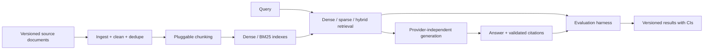

# rag-with-evals

An inspectable RAG pipeline whose primary product is trustworthy measurement: retrieval, faithfulness, abstention, cost, latency, and controlled comparisons.

> **Status:** M0 foundation. No benchmark claims have been measured yet.

## Why this exists

RAG demos often show a single attractive answer. This repository is designed to answer the harder questions: whether the evidence was retrieved, whether an answer is supported by it, when the system should abstain, and whether a configuration change is statistically meaningful.

## Architecture



## Quickstart

Requires Python 3.11–3.13 and [uv](https://docs.astral.sh/uv/).

```powershell
uv sync --extra dev
uv run ruff check .
uv run ruff format --check .
uv run mypy
uv run pytest
```

The default configuration is offline and uses no provider credentials. Provider calls remain blocked until a nonzero spend cap and an explicit provider are configured.

For the complete offline workflow and evaluation dataset format, see [docs/REPRODUCING.md](docs/REPRODUCING.md).

## Design decisions

The initial local index is deliberately CPU-first and file-backed; Docker is not available in the discovered environment. See [docs/DESIGN.md](docs/DESIGN.md) for the full decision log and [docs/LIMITATIONS.md](docs/LIMITATIONS.md) for current limits.

## Limitations

This v0.1.0 release is an offline BM25 baseline, not a measured claim about dense retrieval or LLM answer quality. It makes no benchmark-quality assertion until a licensed corpus, human-verified dataset, and measured result artifacts are available. Remote provider adapters, dense retrieval, reranking, and PDF extraction require optional integrations and their own reproducible evaluation runs.

## Roadmap

- Add license-recorded Python documentation downloader with checksums and incremental manifests.
- Add dense, hybrid, and reranking adapters behind the current retrieval boundary.
- Add provider adapters with recorded fixtures and cost accounting, then compare configurations using the experiment runner.
- Publish only measured corpus-specific results with confidence intervals and human-reviewed labels.

## License

MIT. See [LICENSE](LICENSE).

